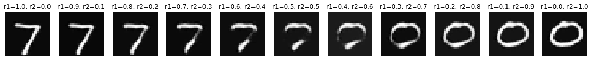
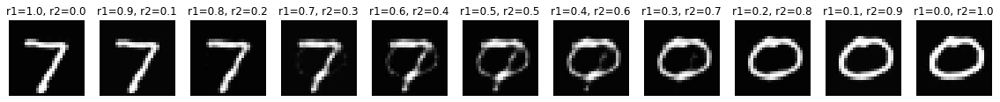
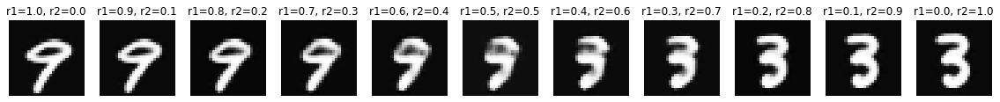
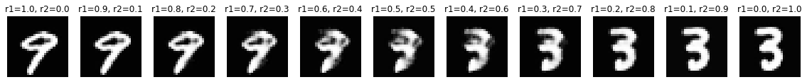

# Implicit Rank-Minimizing Autoencoder

This is implementation of this paper  
*Implicit Rank-Minimizing Autoencoder*  
https://arxiv.org/abs/2010.00679

## run yourself
1. train model
run `python3 train.py` to train model checkpoint file into `./ckpts`  
If you wanna see comparison of vanilla model  
run ../ae/train.py also
2. inspect the effect
run `check.ipynb` to inspect the effect of irmae  

## Plot
### Interpolutions

IRMAE I = 4, letent_dim = 128

IRMAE  

Vanilla AE  

IRMAE  

Vanilla /AE  

IRMAE  

Vanilla AE  
